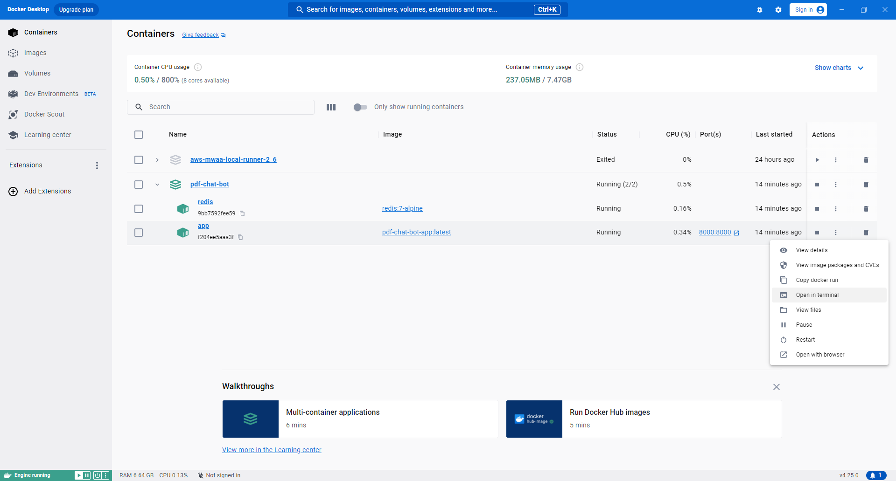
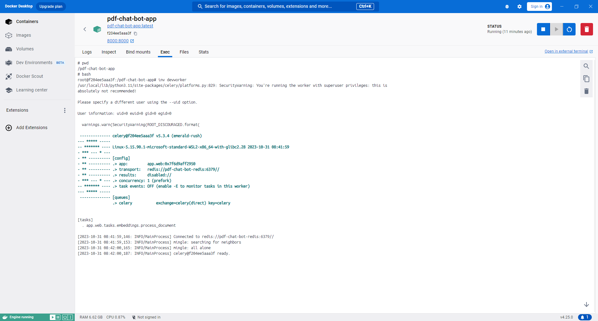

# First Time Setup

```
# Create a virtual environment
python -m venv .venv

# On MacOS, WSL, Linux
source .venv/bin/activate

# On Windows
.\.venv\Scripts\activate

# Install dependencies
pip install -r requirements.txt

# Initialize the database
flask --app app.web init-db
```

### To reset the database

```
flask --app app.web init-db
```


### Run the app in docker container (specifically for celery windows issue)

You'll need <b>Docker Desktop</b> latest version because I'm using docker compose watch for auto-reloading the changes 

Docker file is present in the root directory of the project
1. The file is configured to start the flask project on container startup.
    So there is no need to run the flask server manually i.e. <b>inv dev</b> command is not needed
2. redis server has been added as a dependency of the flask container.
    So there is no need to run the redis server manually i.e. <b>redis-server</b> command is not needed

Make sure you've the redis URL updated in your .env file as below:

<b>REDIS_URI=redis://pdf-chat-bot-redis:6379</b> (pdf-chat-bot-redis is the name of the redis container)

Just run the following commands and the app will be up and running

1. <b>docker compose up --build</b>

2. And in another terminal window run <b>docker compose watch</b> so that the changes made to the code are reflected in the container
3. To start the Celery process in the container:

   i. Once you see the <b>pdf-chat-bot-app</b> docker container running in Docker Desktop, you can Open the terminal as shown below:
   
    
   
    ii. Run the following command in that terminal to start the celery process in the container
             <b>inv devworker</b>
            

4. To shut down all the containers, run the following command:
<b>docker compose down</b>
5. Stop the docker watch process by pressing <b>Ctrl + C</b> in its terminal window
```
